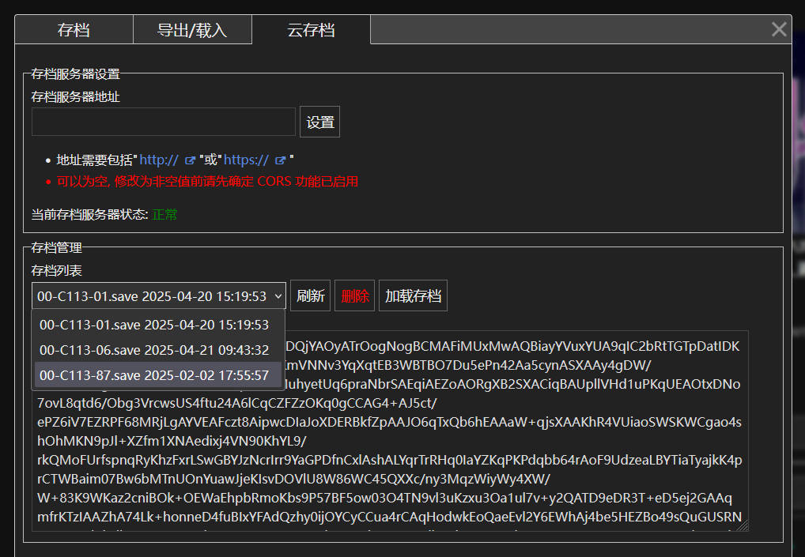

# DoL Save Server

一个用于适用于[Degrees of Lewdity](https://github.com/Eltirosto/Degrees-of-Lewdity-Chinese-Localization)的Web服务程序

## 主要功能

1. 在游戏存档时同步在服务端创建对应存档文件(需要模组加载器并加载配套模组), 并可随时查看和加载
2. 提供简单的用户认证机制(需手动在配置文件中启用), 启用后需要登录才能开始游戏, 且存档根据用户分开保存



## 使用方法

### 快速使用

1. 下载对应系统的压缩包
2. 将压缩包解压到游戏目录
3. 运行程序
4. 打开浏览器, 访问[http://127.0.0.1:5000](http://127.0.0.1:5000)开始游戏

后续如果存档, 则会生成对应的存档文件在游戏目录的`save`文件夹中.

### 查看存档

- 在游戏存档界面可以查看、加载服务端已保存的存档
- 访问`http://服务地址/saves`来查看服务端已保存的存档

### 存档文件名格式

```
{save_type}-{save_name}-{slot}.save
```
- `save_type`: 存档类型, 有以下值
    - `00`：表示使用`indexedDB`存档(默认存档方式)
    - `01`: 旧的存档方式
- `save_name`: 创建角色时输入的存档名称
- `slot`: 存档位置(`0`为自动存档)

### 服务配置

运行时如果不存在配置文件(`dol_save_server.toml`), 将会在运行目录生成默认配置文件, **修改配置后需要重启才能生效**.

详细配置说明请查看[`dol_save_server.toml`](./dol_save_server.toml)
